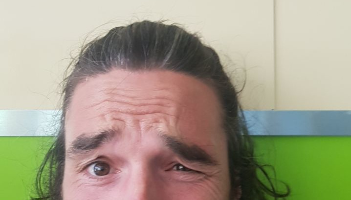

# stefan hubschmid

## Werdegang

Seit früher Kindheit beschäftige ich mich mit gesellschaftlichen Prozessen.
Dabei interessierte mich stets, wie wir als Menschen besser zusammenleben können und wie die Menschheit im Einklang mit der Natur leben kann. Dies füllt meine Gedankenwelt und stellt für mich meine Lebensaufgabe dar.\
Gelernt habe ich Chemielaborant und machte eine Ausbildung zum Homöopathen.\
Seit 2009 Arbeite ich nicht mehr fest und machte verschiedenste Arbeiten.

## Meine Ansicht auf das Leben

Ich sehe die heutige Arbeitswelt nicht als besonders wichtig an. Ich freue mich, wenn gemeinsam Vorangegangen werden kann und spennende, sinnvolle Projekte abgeschlossen werden können. Der gesellschaftliche Kult um Karriere, Geld oder ähnliche Kriterien für die "Wichtigkeit einer Person" innteressieren mich dabei überhaupt nicht.

Ich bin fest überzeugt, dass wir mit der heutigen Produktivität und intelligenten, subsidiären Systemen keine speziellen Massnahmen für Arbeitszwang mehr aufrecht halten müssen. \
Wenn sich die Menschen mit der Menscheit und Umwelt verbunden fühlen, können wir sogar alle institutionellen Strukturen abschaffen und eine quasi Anarchie führen.
Ohne Geld, ohne Handel, nur mit Austausch, Schenkung, freude am gemeinsamen Vorankommen und einer gehörigen Portion Natürlichkeit.

_________________________

## Links

- [Initiative GKW](https://www.initiative-gkw.ch) Eine Initiative, welch ein neues Wirtschaftssystem in der Schweiz aufzeigt.
- [YouTube](https://www.youtube.com/@Initiative-GKW) Mein YouTube - Kanal zur Initiative

